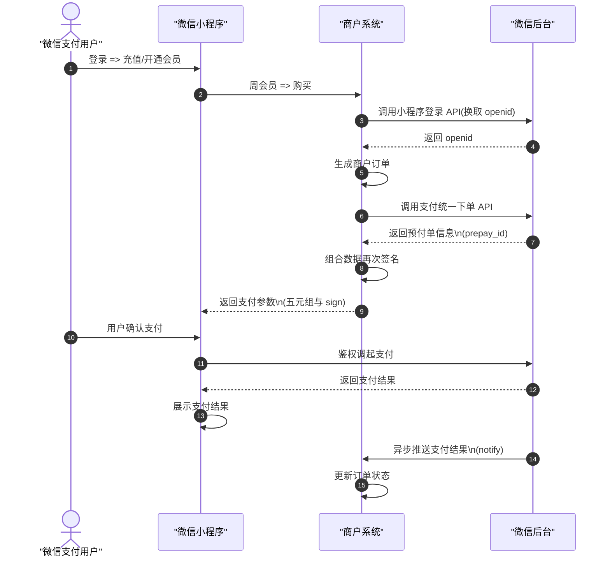

# fb-miniprogram

微信小程序客户端，与 **fb-mobile** 使用同一套 **fb-platform** API（登录、注册、账户、会员、充值、曲线图查询）。

## 功能页面

| 页面 | 对应移动端 | 说明 |
|------|------------|------|
| 登录 | `(auth)/login` | 手机号 + 密码 |
| 注册 | `(auth)/register` | 用户名、性别、密码、手机验证码、邮箱 |
| 首页 | `(app)/home` | 入口菜单、退出登录 |
| 曲线图查询 | `(app)/curves` | 日期/球队搜索；图片经 `wx.downloadFile` 带 JWT 拉取 |
| 账户资料 | `(app)/account` | 资料展示、改密码/邮箱/手机（下拉刷新） |
| 会员状态 | `(app)/membership` | 与 `/api/membership/status` 一致（下拉刷新） |
| 充值 | `(app)/recharge` | `payment_channel: wechat_mp` 调用 `wx.requestPayment`；网页/默认仍为支付宝 |
| 充值记录 | `(app)/records` | `GET /api/pay/orders`（下拉刷新） |

## 配置

1. **AppID**  
   用微信开发者工具打开本目录，在 `project.config.json` 中填写你的小程序 `appid`（测试可选用测试号）。

2. **API 地址**  
   编辑 `utils/config.js`，将 `API_BASE` 改为你的平台 **HTTPS** 根地址（无路径、无末尾 `/`），例如：

   ```js
   const API_BASE = 'https://trybx.cn';
   ```

   须与 **fb-mobile** 的 `EXPO_PUBLIC_API_BASE_URL` 指向同一套后端。

3. **服务器域名（小程序后台）**  
   登录 [微信公众平台](https://mp.weixin.qq.com/) → 开发 → 开发管理 → 开发设置 → **服务器域名**，添加：

   - **request 合法域名**：你的 API 域名（如 `https://trybx.cn`）
   - **downloadFile 合法域名**：同上（曲线图图片走 `/api/curves/img/...`）

   本地调试可在开发者工具 **详情 → 本地设置** 勾选 **不校验合法域名、web-view（含 TLS 版本）、TLS 证书以及 HTTPS 证书**。

4. **短信验证码**  
   与网页/移动端相同：开发环境下验证码在运行 `python run.py` 的终端中打印。

## 导入项目

1. 安装 [微信开发者工具](https://developers.weixin.qq.com/miniprogram/dev/devtools/download.html)。
2. 选择「导入项目」，目录选本仓库下的 `fb-miniprogram`。
3. 填写 AppID 后编译预览。

## 主题

全局样式与移动端 `constants/ui.ts` 深色主题一致（背景 `#050816`、强调色 `#22c55e` 等）。


## 说明

- **支付**：小程序充值走 **微信支付 JSAPI**（登录/进入首页会 `wx.login` → `POST /api/auth/wechat-mp/bind` 绑定 openid）。平台需 `WECHAT_PAY_MODE=v2` 并配置 `WECHAT_MP_*`、`WECHAT_MCH_ID`、`WECHAT_API_KEY`、`PUBLIC_BASE_URL`（HTTPS）；开发可用 `WECHAT_PAY_MODE=mock` + `scripts/simulate_wechat_notify.py` 模拟回调。数据库须含 `users.wechat_mp_openid`（见 `fb-platform/scripts/add_wechat_mp_openid.sql`）。
- **曲线图**：依赖 `downloadFile` 携带 `Authorization: Bearer <token>`，请保证基础库版本较新（建议 `project.config.json` 中 `libVersion` 与工具一致）。




|步骤|方向|动作说明|
|--|---|---|
|❶|微信支付用户 → 微信小程序|进入小程序，下单|
|❷|微信小程序 → 商户系统|请求下单支付|
|❸|商户系统 → 微信后台|调用小程序登录 API（换取 openid）|
|❹|微信后台 → 商户系统|返回 openid|
|❺|商户系统（自身）|生成商户订单|
|❻|商户系统 → 微信后台|调用支付统一下单 API|
|❼|微信后台 → 商户系统|返回预付单信息（含 prepay_id）|
|❽|商户系统（自身）|对组合数据再次签名（生成调起支付参数）|
|❾|商户系统 → 微信小程序|返回支付参数（五元组 + sign / 或 V3 的 RSA 等）|
|➓|微信支付用户 → 微信小程序|用户确认支付|
|⓫|微信小程序 → 微信后台|鉴权并调起支付|
|⓬|微信后台 → 微信小程序|返回支付结果（给小程序侧展示用）|
|⓭|微信小程序（自身）|展示支付结果|
|⓮|微信后台 → 商户系统|异步推送支付结果（notify）|
|⓯|商户系统（自身）|更新订单状态（及发货/开通会员等）|


AppID: wx38c79bc568eeda9a
AppSecret: a8deeab7f1051738999b849d934af171


证书串

-----BEGIN CERTIFICATE-----
MIIERjCCAy6gAwIBAgIUT78ebjf/dwmFoCZuV/0oSQZi5aUwDQYJKoZIhvcNAQEL
BQAwXjELMAkGA1UEBhMCQ04xEzARBgNVBAoTClRlbnBheS5jb20xHTAbBgNVBAsT
FFRlbnBheS5jb20gQ0EgQ2VudGVyMRswGQYDVQQDExJUZW5wYXkuY29tIFJvb3Qg
Q0EwHhcNMjYwNDE5MDgxODEwWhcNMzEwNDE4MDgxODEwWjCBnzETMBEGA1UEAwwK
MTc0NDQwNTQ1NTEbMBkGA1UECgwS5b6u5L+h5ZWG5oi357O757ufMUswSQYDVQQL
DELmrabmsYnluILmrabmmIzljLrotZvmnpzkv6Hmga/lkqjor6Llt6XkvZzlrqTv
vIjkuKrkvZPlt6XllYbmiLfvvIkxCzAJBgNVBAYTAkNOMREwDwYDVQQHDAhTaGVu
WmhlbjCCASIwDQYJKoZIhvcNAQEBBQADggEPADCCAQoCggEBANc/qyyMR5HxP3/2
h0H1jwBZb8xN/nC9LR2/Kc5UgKLfGjjd/81zk41a/YcTHB2Wd3mHXt7S3AavZWux
WqhZcdT1dlD5QKs5J5nkrAiNUdOC3OZzui/i/Gdk62e2QyMTMvfYKkrNRx1PPBnq
wXZFSFk2DO5sDFEBL6UtYS46uqsJ9uAadxymahFPT7322UOYFUx8mwE/hGr7L6Eo
1Eci5YvqS1AI6gj3X/hRJ9zhCy36FID+vGa5xqmJOh5mJ8jc7kWE90BisYPKw53A
InOkvyCIT4qcQyOYTSfVqtuXNm4ITe/FXAUrUj6qBy4g1Wzo6+qaJMBdvKjP5n8H
VO2+eOcCAwEAAaOBuTCBtjAJBgNVHRMEAjAAMAsGA1UdDwQEAwID+DCBmwYDVR0f
BIGTMIGQMIGNoIGKoIGHhoGEaHR0cDovL2V2Y2EuaXRydXMuY29tLmNuL3B1Ymxp
Yy9pdHJ1c2NybD9DQT0xQkQ0MjIwRTUwREJDMDRCMDZBRDM5NzU0OTg0NkMwMUMz
RThFQkQyJnNnPUhBQ0M0NzFCNjU0MjJFMTJCMjdBOUQzM0E4N0FEMUNERjU5MjZF
MTQwMzcxMA0GCSqGSIb3DQEBCwUAA4IBAQCM8Rnds5WE3C+48W2YmKOrGN6nzV/u
lKFUB2C1Zyuv1YEUQWiOS5R4/rmnuArKgXwjQGgShXbT/yfJnq5PvBlGmL42CO6P
dM3KOxeevFqYsLCTZ7CUmSKUdv5yr0iwsRgb0Zy4x5stVJ0R2IFc+CSlgouPDKRH
Il3f5CyqN4wQOUDRNj2Ir70xFpayc56iuKaNpJxArXzFWebghWXFH+0EMI8znTXl
nXoBe6K87LR8nrCi7J3fHYS7U2XDTF5dxkQOT/V2pPSsK6ksHwhV4lwpDBRX9LFu
ncoQuuqRsp+DMrMSQRccXceNGAknXGel8NYD02ZX1R+cBb7IWrS+SJzR
-----END CERTIFICATE-----

APIv2密钥
jK4MeK8hqpFdMPfu72huMjDyvhjZhaa3

APIV3密钥
jK4MeK8hqpFdMPfu72huMjDyvhjZhaa3

mchid: 1744405455

https://pay.weixin.qq.com/doc/v3/merchant/4012791897

curl -X POST \
  https://api.mch.weixin.qq.com/v3/pay/transactions/jsapi \
  -H "Authorization: WECHATPAY2-SHA256-RSA2048 mchid=\"1900000001\",..." \
  -H "Accept: application/json" \
  -H "Content-Type: application/json" \
  -d '{
    "appid" : "wx38c79bc568eeda9a",
    "mchid" : "1744405455",
    "description" : "赛果信息助手",
    "out_trade_no" : "1217752501201407033233368018",
    "time_expire" : "2018-06-08T10:34:56+08:00",
    "attach" : "自定义数据说明",
    "notify_url" : " https://www.weixin.qq.com/wxpay/pay.php",
    "goods_tag" : "WXG",
    "support_fapiao" : false,
    "amount" : {
      "total" : 100,
      "currency" : "CNY"
    },
    "payer" : {
      "openid" : "oUpF8uMuAJO_M2pxb1Q9zNjWeS6o"
    },
    "detail" : {
      "cost_price" : 608800,
      "invoice_id" : "微信123",
      "goods_detail" : [
        {
          "merchant_goods_id" : "1246464644",
          "wechatpay_goods_id" : "1001",
          "goods_name" : "iPhoneX 256G",
          "quantity" : 1,
          "unit_price" : 528800
        }
      ]
    },
    "scene_info" : {
      "payer_client_ip" : "14.23.150.211",
      "device_id" : "013467007045764",
      "store_info" : {
        "id" : "0001",
        "name" : "腾讯大厦分店",
        "area_code" : "440305",
        "address" : "广东省深圳市南山区科技中一道10000号"
      }
    },
    "settle_info" : {
      "profit_sharing" : false
    }
  }'